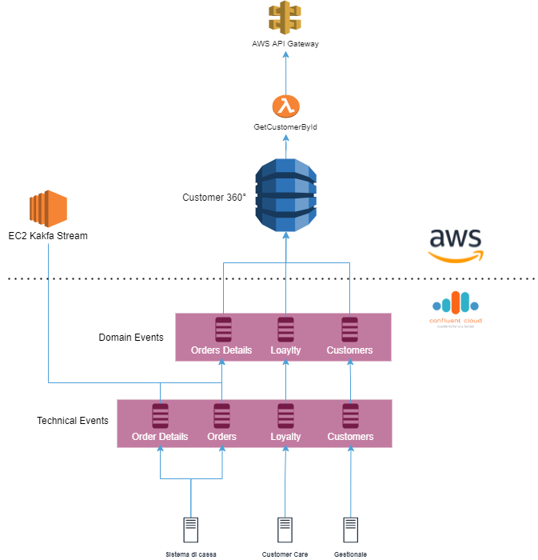

# Demo-AWS-Confluent

## Contenuto
Questo progetto contiene il codice sorgente per la costruzione di una demo sul Digital Integration Hub.  
In particolare, l'architettura prevede le seguenti componenti:

* Un cluster Confluent Cloud su AWS.
* Un database DynamoDB come High Performance Datastore.
* Un'applicazione Kakfa stream che gestisce lo stream processing.
* Dei microservizi implementati in python rilasciati su AWS Lambda.
* Un AWS API Gateway per l'esposizione dei micro-servizi.
* [TODO] Sorgenti da definire.

L'architettura è riportata nell'immagine qui sotto:

 

## Pre-requisiti
Per avviare l'infrastruttura è necessario:  

* Avere un account AWS.
* Avere un account Confluent Cloud.
* Creare un utente AWS assegnandgli il ruolo di amministratore.
* Terraform installato sulla macchina locale.
* Essere in possesso di una [key-pair](https://docs.aws.amazon.com/it_it/AWSEC2/latest/WindowsGuide/ec2-key-pairs.html#prepare-key-pair) per accedere alle macchine EC2.
* Se si volesse entrare in ssh nella macchina EC2 lanciare il comando `chmod 400 <Your Key Path>` e poi `ssh -i <Key Path> ubuntu@<Control Center Public DNS>`

## Avvio Infrastruttura
1. Creare i topic sul cluster confluent cloud lanciando in sequenza:  
`ccloud kafka topic create cdc.orders --cluster <clusterID> --partitions 1`  
`ccloud kafka topic create cdc.order_details --cluster <clusterID> --partitions 1`  
`ccloud kafka topic create orders-details-joined --cluster <clusterID> --partitions 1`  
`ccloud kafka topic create _confluent-monitoring --cluster <clusterID>`
2. Clonare il repository.
3. Spostarsi nella root di progetto e creare il file `.env` e inserire le seguenti informazioni:  

	```
	BOOTSTRAP_SERVERS=<BOOTSTRAP_SERVERS>
	```

	```
	SASL_JAAS_CONFIG=org.apache.kafka.common.security.plain.PlainLoginModule required username="<Confluent Cloud API Key>" password="<Confluent Cloud Secret Key>";
	```

	```
	CONNECT_VALUE_CONVERTER_SCHEMA_REGISTRY_URL=<Confluent Cloud Schema Registry URL>
	```

	```
	AWS_ACCESS_KEY_ID=<AWS_ACCESS_KEY_ID>
	```

	```
	AWS_SECRET_ACCESS_KEY=<AWS_SECRET_ACCESS_KEY>
	```
	
4. Copiare la coppia di chiavi all'interno della cartella `terraform`.
5. Spostarsi all'interno della cartella `terraform`.
6. Creare il file `common.tfvars` e inserire le seguenti informazioni:  

	```
	aws_access_key = "<aws_access_key>"
	```

	```
	aws_secret_key = "<aws_secret_key>"
	```

	```
	accountId = "<aws_account_id>"
	```

	```
	key_name = "<your key-pair name>"
	```

	```
	key_path = "<your key pair path>"
	```
	
7. Lanciare il comando `terraform init`.
8. Lanciare il comando `terraform plan -var-file common.tfvars -out "digital-integration-hub-aws-confluent.tfplan"`.
9. Lanciare il comando `terraform apply "digital-integration-hub-aws-confluent.tfplan"`.
10. Per creare un'istanza del sink-connector DynamoDB effettuare la seguente chiamata REST
```
URL: http://<Control Center Public DNS>:8083/connectors
METHOD: POST
HEADERS: Content-Type: application/json
BODY: {
   "name": "test-dynamo-join",
   "config": {
      "connector.class": "io.confluent.connect.aws.dynamodb.DynamoDbSinkConnector",
      "tasks.max": "1",
      "topics": "orders-details-joined",
      "aws.dynamodb.region": "eu-central-1",
      "aws.dynamodb.endpoint": "https://dynamodb.eu-central-1.amazonaws.com",
      "confluent.topic.bootstrap.servers": "<BOOTSTRAP_SERVERS>",
      "confluent.topic.replication.factor": "3",
      "name": "test-dynamo-join",
      "confluent.topic.security.protocol" : "SASL_SSL",
      "confluent.topic.sasl.jaas.config"  : "org.apache.kafka.common.security.plain.PlainLoginModule required username='<Confluent Cloud API Key>' password='<Confluent Cloud Secret Key>';",
      "confluent.topic.sasl.mechanism": "PLAIN"
   }
}
```

## Distruzione infrastruttura
1. Lanciare il comando `terraform destroy -var-file common.tfvars`.
